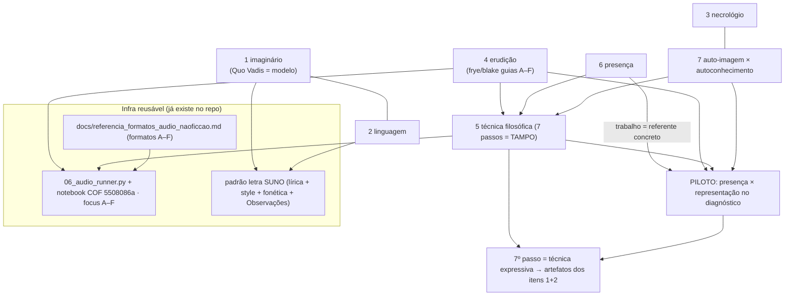

# Práticas formativas da Aula-008 — índice e sistema

> **O que é isto.** A Aula-008 do COF descreve a formação intelectual como uma **mesa**:
> blocos de prática (adestramento do imaginário, enriquecimento da linguagem, necrológio,
> investigação erudita) sustentando um **tampo** (a técnica filosófica de 7 passos), mais
> dois conceitos gnosiológicos que atravessam tudo (conhecimento por presença; auto-imagem
> vs. autoconhecimento). O **item 1** já virou prática viva (ler clássicos em voz alta para
> os pais → áudio NLM por cena → música SUNO simbólica → compartilhar). Este conjunto de
> documentos **replica essa anatomia nos outros seis itens** e **integra o estudo ao
> trabalho** (clínica/OncoBase) num **piloto** com o problema-condutor
> *"conhecimento por presença vs. representação no diagnóstico"*.
>
> Isto não é um acréscimo arbitrário: o **6º passo** da técnica filosófica (Exame de
> Consciência) proíbe guardar a descoberta "numa gaveta acadêmica separada da vida".

---

## 1. Anatomia-modelo — o template de seis campos

Todo item (02–07) e o piloto seguem **exatamente** esta tabela. Foi extraída da prática já
viva do item 1.

| Campo | O que é |
|---|---|
| **Núcleo vivido** | O hábito recorrente, encarnado — não um plano, uma coisa que já acontece (ou vai acontecer) na vida real. |
| **Cadência + gatilho** | Frequência (padrão **2–3×/semana**) **+** *captura-quando-vier-à-tona*: nota de voz ou uma linha num inbox no momento em que o tema surge. |
| **Artefato cognitivo** | A saída estruturada — um *focus-prompt* NLM (formato A–F), um doc, um mapa ou um diário. |
| **Artefato criativo** | A **letra SUNO** (lírica simbólica + *style prompt* + versão fonética + nota "Observações"). |
| **Ancoragem COF** | Qual conceito ou método da Aula-008 a prática operacionaliza. |
| **Loop de compartilhamento** | Como a prática vira relacional (com os pais, colegas) ou auto-corretiva (revisão). |

**Idioma:** docs e diários em **pt-BR**; prompts de ferramenta (SUNO *style*, NLM *focus*)
com **instruções em inglês, saída em pt-BR** (regra global do projeto, ver
`docs/referencia_formatos_audio_naoficcao.md`).

**Restrição inegociável (LGPD + anti-invenção):** zero PII de paciente em qualquer
focus-prompt ou letra. Só o **universal/anonimizado**. A mesma operação do Quo Vadis
(despojar nomes próprios → arquétipo) torna o artefato LGPD-seguro **e** artisticamente
superior. O Art. 1 do método (não inventar) vale para o material clínico: não se fabrica
caso, dado nem citação.

---

## 2. Como os sete itens se entrelaçam



Leitura do diagrama: os blocos de prática (1–4, 6, 7) **alimentam o tampo** (5, a técnica
de 7 passos), cujo último passo (técnica expressiva) **devolve** a descoberta aos artefatos
criativos dos itens 1 e 2. O item 6 (presença) é o que **puxa o trabalho para dentro** do
estudo, gerando o piloto. Nada é gerado do zero: tudo reusa o motor de áudio, os formatos
A–F e o padrão SUNO já existentes.

---

## 3. Cadências consolidadas

| Item | Cadência sugerida | Gatilho de captura |
|---|---|---|
| 1 imaginário | 2–3×/semana (leitura em voz alta) | trecho que emocionou → nota |
| 2 linguagem | diária leve (1 palavra/expressão) | palavra que "não soube usar" |
| 3 necrológio | 1×/semana (1 figura) | obituário/notícia de morte lida |
| 4 erudição | 2×/semana (1 stack A·B·D) | dúvida que exige *status quaestionis* |
| 5 técnica | 1 ciclo/quinzena (1 problema) | problema que "não sai da cabeça" |
| 6 presença | diária (atenção); registro 2–3×/sem | encontro real com pessoa/coisa |
| 7 auto-imagem | semanal (exame) | reação desproporcional minha |

Padrão transversal: **2–3×/semana + captura-quando-vier-à-tona**. A cadência serve à vida,
não a vida à cadência.

---

## 4. Glossário

- **Formatos A–F (não-ficção).** Leque de áudios NLM, cada um uma operação cognitiva:
  **A Pórtico** (orientação/mapa), **B Reconstrução** (habitar o sistema por dentro),
  **C Arena** (fichamento dialético: *videtur* → *sed contra* → *respondeo*),
  **D Filtro** (conceito real × símbolo autojustificativo), **E Meditatio** (confronto com
  a experiência), **F Léxico** (glossário curto). Definição-mãe:
  `docs/referencia_formatos_audio_naoficcao.md`. Stack padrão: **A·B·D**.
- **Ficção (4 pilares) × não-ficção (A–F).** A **ficção** usa a skill `leitura-formativa`
  (educação da imaginação, leitura de cena, áudio deep-dive por cena — ver Quo Vadis). A
  **não-ficção** usa os formatos A–F. São dois aparatos distintos; não confundir.
- **Círculo de latência.** Termo de procedência **a confirmar** (coinagem de Olavo? tradução
  de Lavelle/Husserl?). Pergunta e comando `nlm` para resolver: ver §6.
- **Auto-imagem × autoconhecimento (item 7).** *Auto-imagem* = a representação que faço de
  mim (papéis, ideal, máscara); *autoconhecimento* = contato com o que de fato sou,
  inclusive o que a auto-imagem encobre. A formação visa migrar de uma para o outro.
- **Presença × representação (item 6 / piloto).** *Conhecimento por presença* = a coisa
  dada ela mesma, irredutível e inesgotável (o paciente diante de mim). *Representação* =
  um substituto finito e guardável da coisa (prontuário, laudo, CID). Máxima operacional:
  **na dúvida, a presença corrige a representação, nunca o contrário.**
- **PII.** Dado pessoal identificável de paciente (nome, CPF, prontuário, datas, imagem).
  **Proibido** em qualquer artefato deste conjunto.

---

## 5. Mapa de arquivos

```
praticas_aula008/
  00_INDICE_E_SISTEMA.md          ← este arquivo
  01_adestramento_imaginario.md   ← referência ao modelo vivo (Quo Vadis)
  02_enriquecimento_linguagem.md
  03_necrologio.md
  04_investigacao_erudita.md
  05_tecnica_filosofica.md        ← o tampo: os 7 passos
  06_conhecimento_por_presenca.md
  07_autoimagem_autoconhecimento.md
  integracao/
    PILOTO_presenca_vs_representacao.md
    diagnostico_representacao_vs_presenca_workflows.md   ← gabarito (preencher local)
  templates/
    nlm_focus_*.md      suno_style_*.md      diario_*.md
```

Infra reusada (não recriar): `scripts/06_audio_runner.py`, notebook COF
`5508086a-da53-4947-bce4-a1d7d83cf0e2` (`_sources_map.json`),
`docs/referencia_formatos_audio_naoficcao.md`, `projetos/literatura/quo_vadis/prompts_cenas/`,
`projetos/critica-literaria/frye/.../guias/` e `.../blake/guias/`, skill `leitura-formativa`.

---

## 6. Next-steps locais (precisam de `nlm`/rede/vault — ausentes neste container)

Estes comandos **não rodam no ambiente remoto** (sem `nlm`, sem auth Google, sem o vault
Obsidian). Ficam documentados para execução na máquina do usuário.

**Gerar um áudio a partir de um focus-prompt deste conjunto:**

```bash
cd projetos/filosofia/cof_v2
python3 scripts/06_audio_runner.py --dry-run --max 1   # confere o plano (flags reais)
# invocação direta do nlm, exatamente como o runner monta (06_audio_runner.py:306):
nlm create audio 5508086a-da53-4947-bce4-a1d7d83cf0e2 \
  --format deep_dive \
  --language pt-BR \
  --length long \
  --focus "$(cat praticas_aula008/templates/nlm_focus_piloto.md)" \
  --source-ids <SOURCE_ID> \
  --profile default \
  --confirm
```
(O `--focus` deve conter só o texto do prompt — retire os comentários `<!-- -->` do template.
`--length` pode ser `default` p/ áudio mais curto; ver `docs/referencia_formatos_audio_naoficcao.md`.)

**Resolver a procedência de "círculo de latência" (tarefa T-procedência):**

```bash
# notebook COF
nlm chat 5508086a-da53-4947-bce4-a1d7d83cf0e2 --profile default \
  "Qual a procedência da expressão 'círculo de latência'? É coinagem de Olavo de Carvalho
   ou tradução de termo de Lavelle/Husserl? Cite a fonte."
# cruzar com o notebook Lavelle
nlm chat 1e63d07b-d9ee-4b13-b7fb-808c53072b79 --profile default \
  "Lavelle usa noção de 'latência' ligada à presença/participação? Onde? Cite."
```
Preencher a resposta citada no glossário (§4) quando rodar.

**Gerar a faixa SUNO:** colar `templates/suno_style_<item>.md` + a lírica no SUNO
(geração manual, como já é o fluxo). 

**Diários vivos e vault Obsidian:** os `templates/diario_*.md` são para uso pessoal em
`~/Projetos_Ob_Vault/.../Personal/`; ao encerrar sessão, registrar log e indexar no
`INDEX.md` conforme `CLAUDE.md` (seção Vault Obsidian).
