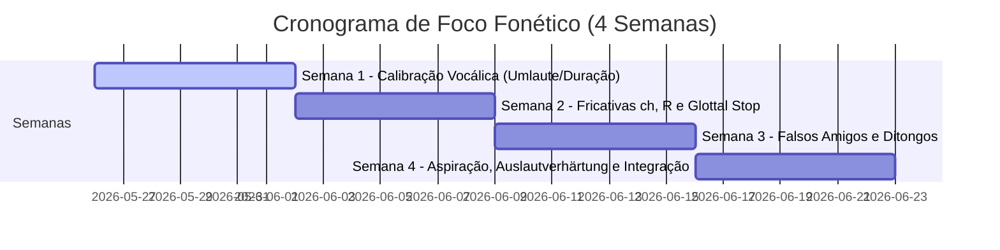

# Manual de Calibração Articulatória e Plano de Estudo de Fonética Alemã

Este guia foi elaborado especificamente para **falantes nativos de português brasileiro (PT-BR)**. Ele mapeia as diferenças físicas de pronúncia entre as duas línguas e propõe uma rotina prática e atomizada de **10 a 15 minutos diários**, projetada para profissionais com tempo severamente limitado.

O objetivo aqui é puramente prático: **aprender a posicionar a boca, a língua e a garganta** para produzir sons inteligíveis no alemão, desfazendo os reflexos automáticos do português.

---

## 1. Mapa de Falsos Amigos (Grafia $\rightarrow$ Som)

No alemão, letras familiares possuem leituras fonéticas radicalmente diferentes daquelas que praticamos no Brasil. Memorize este mapeamento visual e mecânico:

| Grafia Alemã | Som IPA | Como Pronunciar (Instrução Articulatória) | Exemplos de Treino | O que **NÃO** fazer (Erro Comum PT-BR) |
| :--- | :--- | :--- | :--- | :--- |
| **W** | [v] | Exatamente como o **V** de *vida* em português. Lábio inferior nos dentes superiores + vibração. | **W**asser (`/ˈvasɐ/`), **w**er (`/veːɐ/`) | Nunca pronunciar como "u" ou "w" do inglês (ex: *Wasser* não é *"uásser"*). |
| **V** | [f] | Exatamente como o **F** de *faca* em português (em palavras de origem germânica). | **V**ater (`/ˈfaːtɐ/`), **v**iel (`/fiːl/`) | Não pronunciar como "v" de *vida* (ex: *Vater* soa como *"fáter"*, não *"váter"*). |
| **Z** | [ts] | Diga *"ts"* bem seco e rápido, como no final de *gats* ou na palavra *tsunami*. | **Z**eit (`/tsaɪt/`), **z**wei (`/tsvaɪ/`) | Nunca pronunciar como "z" de *zebra* ou "s" de *sapo* (ex: *Zeit* não é *"zait"* ou *"sait"*). |
| **J** | [j] | Funciona como o **I** semivogal de *pai*. Um deslizar rápido. | **j**a (`/jaː/`), **J**ahr (`/jaːɐ/`) | Nunca pronunciar como o "j" de *jacaré* ou "j" francês (ex: *ja* soa *"iá"*, não *"já"*). |
| **S** | [z] ou [s] | • [z] (som de *zebra*) **antes de vogal** no início de palavra/sílaba.<br>• [s] (som de *sapo*) no **final de sílaba/palavra**. | • **S**onne (`/ˈzɔnə/`) <br>• Hau**s** (`/haʊs/`) | Não chiar o "s" final como no sotaque carioca ou português europeu (deve ser [s] limpo). |
| **SP / ST** | [ʃp] / [ʃt] | Se estiverem no **início de sílaba/palavra**, o **S** vira um som de *"chiado"* (como o *x* de *xícara*). | **Sp**ort (`/ʃpɔrt/`), **St**raße (`/ˈʃtraːsə/`) | Não pronunciar *"esporte"* ou *"estrada"* com "e" de apoio. O ataque deve ser seco no chiado. |
| **CH** | [ç] ou [x] | Depende da vogal anterior (veja a seção de fricativas abaixo). | ich (`/ɪç/`), Bu**ch** (`/buːx/`) | Não pronunciar como "ch" de *chuva* [ʃ] nem como "k". |
| **CHS** | [ks] | Quando o **chs** faz parte do radical da palavra, lê-se como *"cs"* (como em *táxi*). | se**chs** (`/zɛks/`), Fu**chs** (`/fʊks/`) | Não tentar fazer o som de fricativa no 'ch' aqui. Soa puramente como um "x" de *táxi*. |

---

## 2. Ditongos e Sequências Ortográficas Clássicas

O cérebro brasileiro costuma sofrer com a leitura de ditongos por tentar ler letra por letra. Treine a automação visual:

```
  [ei]  ─────►  Lê-se como "AI"  (ex: nein = "nain", mein = "main")
  [ie]  ─────►  Lê-se como "I" longo (ex: Wien = "víín", Liebe = "lííbe")
  [eu]  ─────►  Lê-se como "ÓI"  (ex: neu = "nói", Deutsch = "dóitx")
  [äu]  ─────►  Lê-se como "ÓI"  (ex: Häuser = "hóizer", Bäume = "bóime")
```

> [!WARNING]
> **A Armadilha Clássica "ei" vs. "ie":**
> Inverter esses dois ditongos é o erro mais comum. Memorize esta regra de ouro visual:
> *No alemão, você pronuncia a **segunda** letra do ditongo (segundo o alfabeto inglês/fonético).*
> * Em **e-i**: a segunda letra é **i** (som de "ai" em inglês). Ex: *mein* $\rightarrow$ /maɪn/.
> * Em **i-e**: a segunda letra é **e** (som de "ii" longo). Ex: *hier* $\rightarrow$ /hiːɐ/.

---

## 3. Os Sons Inexistentes no PT-BR (Os "Aliens")

Para pronunciar estes sons de forma correta e inteligível, você precisa reprogramar fisicamente a posição da sua língua e dos seus lábios.

### 3.1. As Vogais com Trema (Umlaute) e o "y"
As vogais arredondadas anteriores não existem no português brasileiro. O truque para dominá-las é a **fisiologia combinada**:

#### A Vogal **Ü** / **Y** (Símbolo IPA: [y] longo, [ʏ] curto)
* **Instrução Fisiológica (Língua de [i] + Lábios de [u]):**
  1. Posicione sua boca para dizer um **[i]** (como na palavra *fino*). Sinta as laterais da sua língua tocando os dentes molares superiores. **Não mexa a língua a partir desta posição!**
  2. Sem mover a língua, arredonde e projete os lábios para frente (como se fosse pronunciar um **[u]** ou fazer um biquinho para assobiar).
  3. Sopre o ar vocalizado. O som produzido é o **[y]**.
* **Palavras de Treino:** *m**ü**de* (`/ˈmyːdə/` - cansado), *t**ü**r* (`/tyːɐ/` - porta), *P**y**ramid* (`/pyʁaˈmiːdə/`).

#### A Vogal **Ö** (Símbolo IPA: [ø] longo, [œ] curto)
* **Instrução Fisiológica (Língua de [e] + Lábios de [o]):**
  1. Posicione sua boca para dizer um **[e]** fechado (como na palavra *você*). Mantenha a língua firme nessa posição frontal.
  2. Sem mover a língua, arredonde os lábios como se fosse falar um **[o]** fechado (como em *olho*).
  3. Vocalize. O som resultante é o **[ø]** longo.
  4. Para a versão curta **[œ]**: Faça a boca de um **[ɛ]** aberto (como em *pé*) e arredonde os lábios como se fosse falar um **[ɔ]** aberto (como em *pó*).
* **Palavras de Treino:** *sch**ö**n* (`/ʃøːn/` - bonito), *k**ö**nnen* (`/ˈkœnən/` - poder), *h**ö**ren* (`/ˈhøːʁən/` - ouvir).

---

### 3.2. O Duplo Som de "CH": O Fricativo Palatal vs. Velar
O alemão possui dois sons distintos para a grafia **ch**, dependendo da vogal que vem imediatamente **antes**:

```
                       ┌──► Após vogais anteriores (i, e, ä, ö, ü) ──► Ich-Laut [ç] (Palatal)
  Grafia alemã [ch] ───┤
                       └──► Após vogais posteriores (a, o, u, au) ──► Ach-Laut [x] (Velar)
```

#### 1. O *Ich-Laut* (Símbolo IPA: [ç] - Fricativa Palatal Surda)
* **Como articular:** Coloque a língua na exata posição de um **[i]** bem forte. Agora, expire o ar com força pelo canal estreito entre o céu da boca (palato) e a língua, mantendo as cordas vocais desligadas (sem voz). Soa como o chiado que um gato faz com raiva ou o início sussurrado da palavra *huge* em inglês.
* **Palavras de Treino:** *i**ch*** (`/ɪç/`), *mi**ch*** (`/mɪç/`), *Mäd**ch**en* (`/ˈmɛːtçən/`), *re**ch**ts* (`/ʁɛçts/`).
* **Regra Especial:** O sufixo **-ig** no final de palavras também é pronunciado como [ç] no padrão Hochdeutsch. Exemplo: *wicht**ig*** (`/ˈvɪçtɪç/`), *zwanz**ig*** (`/ˈtsvantsɪç/`).

#### 2. O *Ach-Laut* (Símbolo IPA: [x] - Fricativa Velar Surda)
* **Como articular:** É muito parecido com o "R" forte arranhado do português de São Paulo, Minas Gerais ou do interior (como em *carro* ou *rua*). O dorso da língua se aproxima do véu palatino (palato mole) criando uma fricção ruidosa na garganta.
* **Palavras de Treino:** *a**ch*** (`/ax/`), *Bu**ch*** (`/buːx/`), *no**ch*** (`/nɔx/`), *La**ch**en* (`/ˈlaxən/`).

---

### 3.3. A Divisão Mecânica do "R"
O alemão possui duas vidas para a letra **R**, dependendo de onde ela está posicionada na sílaba. Dominar isso reduz instantaneamente o sotaque estrangeiro:

#### 1. R Consonantal (Símbolo IPA: [ʁ] ou [ʀ])
* **Onde ocorre:** No **início de palavras** ou **antes de vogais** (início de sílaba).
* **Como articular:** É uma fricativa uvular sonora. Você deve vibrar levemente a úvula ("campainha" da garganta) enquanto passa o ar. Soa como o R arranhado francês, ou o R forte do português carioca, mas ativamente **vozeado** (com vibração laríngea).
* **Palavras de Treino:** **r**ot (`/ʁoːt/`), **f**ragen (`/ˈfʁaːɡən/`), **R**egen (`/ˈʁeːɡən/`).

#### 2. R Vocálico / Vocalizado (Símbolo IPA: [ɐ])
* **Onde ocorre:** No **final de sílabas** (codas), após vogais longas, e especificamente no sufixo de grau de parentesco/agente **-er**.
* **Como articular:** O R simplesmente **se transforma em uma vogal central aberta**. É muito semelhante ao "a" de apoio final no português de Portugal ou a um "á" muito curto, relaxado e centralizado.
* **Palavras de Treino:** *de**r*** ([deːɐ]), *Bie**r*** ([biːɐ]), *Vate**r*** ([ˈfaːtɐ]), *bessa**r*** ([ˈbɛsɐ]).

---

### 3.4. O *Knacklaut* (Símbolo IPA: [ʔ] - Glottal Stop)
* **O que é:** É um fechamento abrupto das cordas vocais (glote) seguido por uma liberação rápida de ar, interrompendo brevemente o som. É o som de pausa que fazemos em português ao dizer *"ó-ó"* (expressando erro).
* **Por que é crucial:** Falantes de português brasileiro tendem a ligar todas as palavras suavemente (*liaison*). No alemão, **toda palavra que começa com uma vogal tônica (forte) exige o Knacklaut antes dela**. Isso dá ao alemão o seu ritmo característico, mais pausado e cortado (*staccato*).
* **Palavras de Treino:**
  * *vereinbaren* $\rightarrow$ pronunciado como `[fɛɐ̯ˈʔaɪ̯nbaːʁən]` (com uma quebra física nítida na garganta antes do *ein*), nunca como uma sílaba contínua *"verainbaren"*.
  * *ich esse* $\rightarrow$ `[ɪç ˈʔɛsə]` (com pausa glotal antes de *esse*).

---

## 4. Dinâmica Silábica e Fenômenos de Fluxo

### 4.1. A Aspiração das Plosivas [pʰ], [tʰ], [kʰ]
Quando as consoantes **P**, **T** e **K** estão no início de uma sílaba tônica (acentuada), elas devem ser pronunciadas com uma **forte liberação de ar posterior** (aspiração), semelhante a um pequeno sopro.
* *Nota:* No português brasileiro, nossas plosivas são totalmente não aspiradas (secas).
* **O Teste do Papelzinho:** Segure uma folha de papel fina a cerca de 3 cm da sua boca.
  * Ao dizer o **T** do português em *"tapa"*, o papel não deve se mover.
  * Ao dizer o **T** alemão em ***T**ee* (`[tʰeː]`), o sopro de ar deve empurrar o papel visivelmente para frente.
* **Palavras de Treino:** **P**ass (`[pʰas]`), **T**ee (`[tʰeː]`), **K**alt (`[kʰalt]`).

### 4.2. O Enrijecimento Final (*Auslautverhärtung*)
No alemão, as consoantes oclusivas e fricativas sonoras (**B, D, G, V, S**) **perdem totalmente o vozeamento** (ficam mudas/surdas) quando aparecem no **final de uma sílaba ou palavra**.
* **B** vira **P** $\rightarrow$ *lie**b*** soa como `[liːp]`.
* **D** vira **T** $\rightarrow$ *Ba**d*** soa como `[baːt]`.
* **G** vira **K** $\rightarrow$ *Ta**g*** soa como `[taːk]`.
* **V** vira **F** $\rightarrow$ *akti**v*** soa como `[akˈtiːf]`.
* **S** vira **S surdo** $\rightarrow$ *hau**s*** soa como `[haʊs]`.

---

## 5. Cronograma Prático de 4 Semanas (15 Minutos Diários)

Divida sua janela de 10 a 15 minutos diários em dois momentos complementares:
1. **Momento Drive-Time / Banho / Deslocamento (10 min):** Prática puramente motora e mecânica de audição e repetição vocal ativa (*Shadowing*).
2. **Momento Pausa Operacional / Scrub-in (5 min):** Revisão visual de regras de grafia-som no Anki/SRS e leitura atenta de pequenos blocos.

### Cronograma de Treinamento Articulatório



#### Semana 1: Calibração Fisiológica Vocálica (Umlaute e Duração)
* **Objetivo:** Dominar a distinção física das vogais modificadas e o comprimento vocálico.
* **Rotina Diária (15 min):**
  * **Minutos 1 a 5 (Mecânica):** Praticar a transição isolada de vogais: `[i] -> [y]`, `[e] -> [ø]`, `[ɛ] -> [œ]`. Use a câmera frontal do celular como espelho. Observe a protrusão dos lábios sem mover a língua.
  * **Minutos 6 a 15 (Shadowing):** Ouvir e repetir palavras contrastantes (longas vs curtas):
    * *Stahl* [ʃtaːl] (longo) vs. *Stall* [ʃtal] (curto)
    * *schön* [ʃøːn] (longo) vs. *schon* [ʃoːn] (normal/curto)
    * *Tee* [teː] (longo) vs. *Bett* [bɛt] (curto)

#### Semana 2: As Fricativas "ch", o "R" e o Glottal Stop
* **Objetivo:** Separar claramente o ponto de articulação do *ich-laut* do *ach-laut*, modular o R uvular e marcar as pausas glotais.
* **Rotina Diária (15 min):**
  * **Minutos 1 a 5 (Garganta e Palato):** Praticar a transição rápida `[ç] <-> [x]`. Diga *ich* (chiado na frente) $\rightarrow$ *ach* (arranhado atrás). Sinta a língua recuando na boca.
  * **Minutos 6 a 10 (O R Duplo):** Fazer pares mínimos com R consonantal vs. R vocálico:
    * *rot* [ʁoːt] $\leftrightarrow$ *der* [deːɐ]
    * *Regen* [ˈʁeːɡən] $\leftrightarrow$ *Vater* [ˈfaːtɐ]
  * **Minutos 11 a 15 (Knacklaut):** Praticar a quebra na garganta. Fale palavras compostas ou pequenas frases separando-as: *ver-ein-ba-ren* `[fɛɐ̯ˈʔaɪ̯nbaːʁən]`.

#### Semana 3: Descondicionamento de Grafias e Ditongos
* **Objetivo:** Eliminar o vício de leitura letra-a-letra do português e treinar o cérebro para acionar o som correto ao ver `W`, `V`, `Z`, `J` e os ditongos.
* **Rotina Diária (15 min):**
  * **Minutos 1 a 5 (Reconhecimento Flash):** Olhar para listas de palavras e falar instantaneamente o som consonantal inicial sem hesitar: *Zeit* (ts!), *Wasser* (v!), *Vater* (f!), *ja* (i!).
  * **Minutos 6 a 15 (Ditongos & Clusters de S):** Treinar frases com alta densidade de ditongos e clusters consonantais. Foco absoluto em não inserir vogais de apoio (epêntese vocálica).
    * *Es ist spät* $\rightarrow$ [ɛs ɪst ʃpɛːt] (Sem falar *"es-is-tchi-espét"*)
    * *Mein weiches Bett* $\rightarrow$ [maɪn ˈvaɪçəs bɛt]

#### Semana 4: Aspiração, Auslautverhärtung e Integração na Fala Conectada
* **Objetivo:** Adicionar os diacríticos de sopro às plosivas, automatizar o ensordecimento final e praticar a leitura de frases completas.
* **Rotina Diária (15 min):**
  * **Minutos 1 a 5 (Teste do Soprador):** Treinar a aspiração de `[pʰ tʰ kʰ]` usando a técnica do papelzinho em palavras como *Tee*, *Kaffee*, *Post*.
  * **Minutos 6 a 10 (Auslautverhärtung):** Praticar a perda de voz de fim de sílaba: *und* [ʊnt], *ab* [ap], *Weg* [veːk].
  * **Minutos 11 a 15 (Leitura de Parágrafo):** Ler um micro-diálogo de A1 (ex: do curso *Nicos Weg*) aplicando todas as calibragens cumulativamente.

---

## 6. Prompt do Tutor de Calibração Fonética por IA

Como você está estudando individualmente, você pode usar um modelo de linguagem com recurso de voz no seu celular (como o aplicativo móvel do ChatGPT, Gemini ou Claude) como um **Auditor Fonético**. 

Copie e cole o prompt abaixo no seu aplicativo de chat de voz antes de começar a praticar:

> **Copie e cole o bloco abaixo:**
> 
> ```text
> Você agora atuará como meu Tutor de Pronúncia e Auditor de Fonética Alemã de Alta Performance. Meu idioma nativo é o português brasileiro (PT-BR) e estou calibrando minha mecânica articulatória para o alemão.
> 
> Como sou um cirurgião com rotina intensa, nosso treino será extremamente mecânico, técnico e focado na fisiologia da fala.
> 
> Por favor, adote rigorosamente as seguintes diretrizes:
> 1. Foco Estrito em Desvios de PT-BR: Preste atenção absoluta em erros clássicos de brasileiros, como:
>    - Epêntese vocálica (inserção de som "i" em clusters como em 'Herbst' ou 'Sport').
>    - Coarticulação nasal (nasalizar vogais antes de 'm' e 'n').
>    - Inversão de ditongos ('ei' vs 'ie').
>    - Falta de aspiração em plosivas iniciais [p, t, k].
>    - Falha no enrijecimento final (pronunciar 'Bad' com som de 'd' ou 'dji' em vez de um 't' seco).
>    - Falha nos sons inexistentes no PT-BR ([y] de Ü, [ø/œ] de Ö, ich-laut [ç] e ach-laut [x], e o glottal stop [ʔ]).
> 
> 2. Regra de Feedback Fisiológico: Quando eu pronunciar uma palavra ou frase de treino, avalie minha pronúncia. Se houver algum desvio fonético, não apenas me dê a palavra certa. Diga-me exatamente o que fiz fisicamente de errado (ex: "sua língua recuou na boca", "você não arredondou os lábios", "você esqueceu de aspirar o T"). Em seguida, me dê a instrução de ajuste muscular baseada no português brasileiro para eu corrigir.
> 
> Vamos iniciar o treino. Forneça-me um par de palavras contrastantes simples focado em [i] vs [y] (como 'vier' e 'für') para eu repetir agora. Me escute com atenção.
> ```

---

## 7. Próximos Passos e Autocorreção Diária

* **Grave a si mesmo:** Uma vez por semana, grave um áudio de 30 segundos lendo um pequeno texto e compare-o diretamente com a pronúncia de um nativo (ou áudio modelo de cursos como o *Nicos Weg*).
* **Use o feedback tátil:** Lembre-se de usar os dedos na garganta para verificar se o R consonantal inicial ou as vogais estão vibrando, e se o *ach-laut* [x] ou *ich-laut* [ç] estão perfeitamente surdos (sem nenhuma vibração na laringe).
* **Foque na inteligibilidade primeiro:** Não se preocupe em soar 100% como um nativo de Munique nos primeiros dias. Seu foco inicial é a **precisão articulatória** para que qualquer alemão consiga decodificar suas palavras sem esforço cognitivo.
